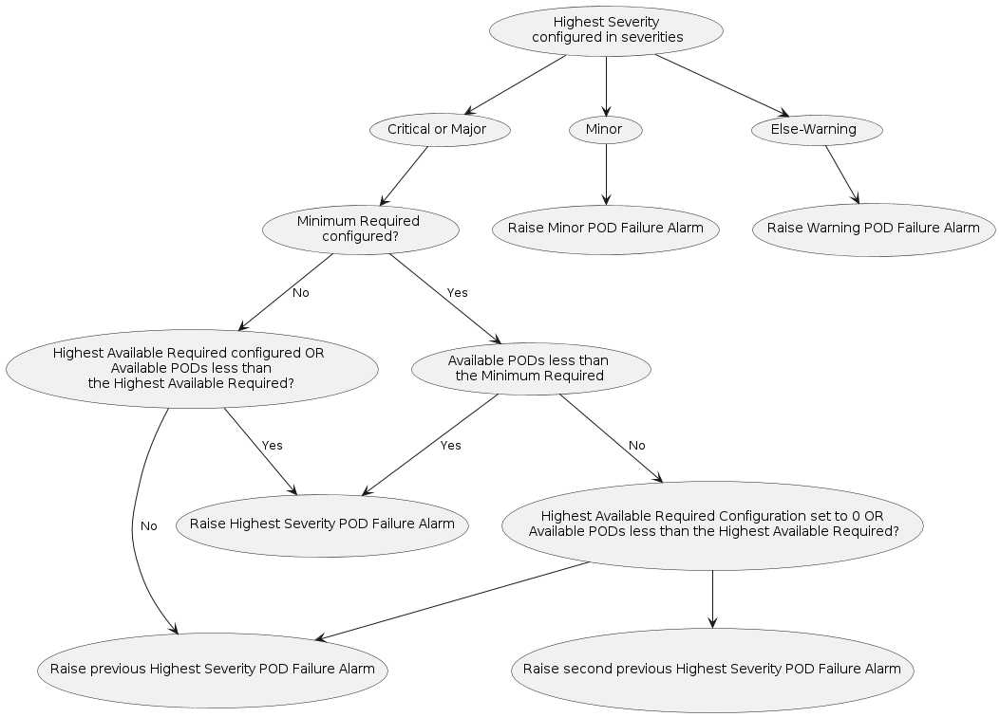

# POD Failure Alarm Severities Calculation

This document explains how the POD Failure alarm severities are calculated
based on the UML diagram below.

1. **Initial Severity Check**
   - The process begins with the **Highest Severity configured in severities**.
   - It first checks if this severity is **Critical or Major**. If not, it moves
to check if it's **Minor**. If neither, it defaults to **Else-Warning**.

2. **Critical or Major Severity Path**
   - If the severity is **Critical or Major**, the process checks if the
**Minimum Required** is configured.
   - If **Minimum Required** is not configured, it further checks if the
**Highest Available Required** is configured or if the **Available PODs**
are less than the **Highest Available Required**.
     - If either condition is true, it raises the
**Highest Severity POD Failure Alarm**.
     - If neither condition is true, it raises the previous highest severity
POD Failure Alarm as configured.

3. **Minimum Required Configured Path**
   - If the **Minimum Required** is configured, the process checks if the
**Available PODs** are less than the **Minimum Required**.
     - If yes, it raises the **Highest Severity POD Failure Alarm**.
     - If no, it checks if the **Highest Available Required**
is set to 0 or if the **Available PODs** are less than the
**Highest Available Required**.
     - Depending on the condition, it either raises the second previous highest
severity POD Failure Alarm or the previous highest severity POD Failure
Alarm.

4. **Minor Severity Path**
   - If the highest severity is determined to be **Minor**, it directly raises
the **Minor POD Failure Alarm**.

5. **Else-Warning Path**
   - If none of the above conditions are met, it raises the
**Warning POD Failure Alarm**.
